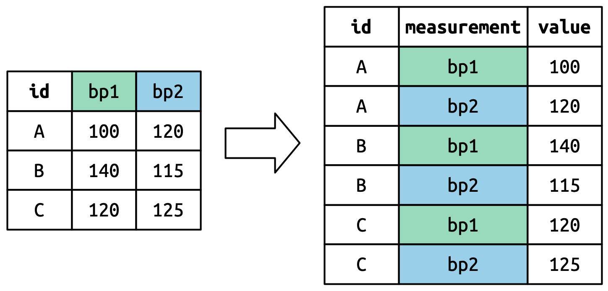

## Reading:

### Required Reading (everyone):

* R for Data Science, Ch. 4--6.

### Reading Notes:

# Overview of the reading

* See the homework assignment for the exercises you whould do.

## Chapter 4

This very short chapter goes over guidance on style for naming variables
and functions and formatting your code to make it easy to read and keep
it organized.


## Chapter 5

This chapter introduces principles of tidy data and tools in R for
organizing your data into tidy formats. 

### Principles of Tidy Data

The fundamental idea is that there are many ways to organize a data set
in a table with rows and columns. Different kinds of analysis call for
different ways of organizing your data. However, for all these ways
of organizing, there is an overarching principle, illustrated in the 
figure below:

1. Each variable is a column and each column is a variable
2. Each observation is a row, and each row is an observation
3. Each value is a cell and each cell is a value



### Pivoting Data

The chapter has two principle parts, each of which focuses on a 
different aspect of _pivoting_ data by rearranging rows and columns.

#### Lengthening Data

The first part looks at tools for _lengthening_ data by combining many 
columns into a single column and adding another column to indicate what
each row signifies.



The key thing to pay attention to in this reading is the 
`pivot_longer()` function. The `distinct()` function is also important,
because it helps us eliminate redundant rows.

Focus on sections 5.3.1 and 5.3.2. 

Section 5.3.3 gets into fancier ways to lengthen data, which you will 
probably not need, so you can skim this section lightly.

However, do pay enough attention to section 5.3.3 that you will know
what is possible and can return to it later if you're reading in 
complicated data and need the more powerful tools to organize it.

#### Widening Data

The second part looks at tools for _widening_ data by splitting up
one column into multiple columns. _Widening_ is much simpler than 
_lengthening_ data, so this section is shorter. The key thing here
is to become familiar with the `pivot_wider()` function.
